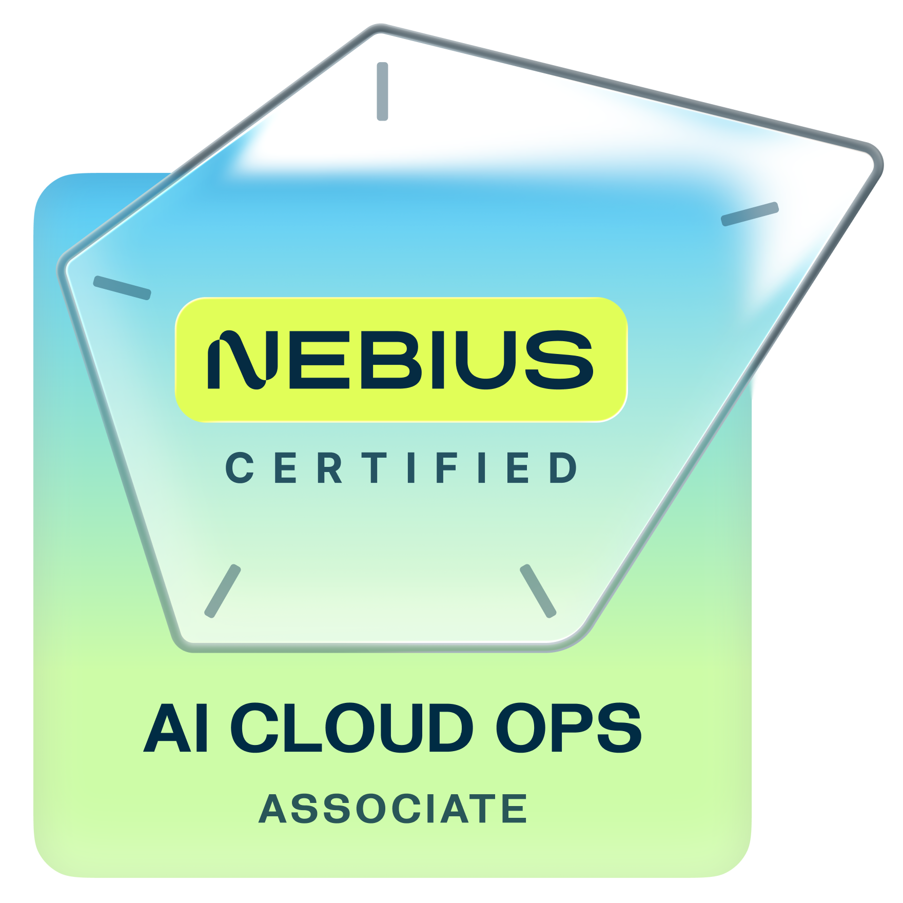
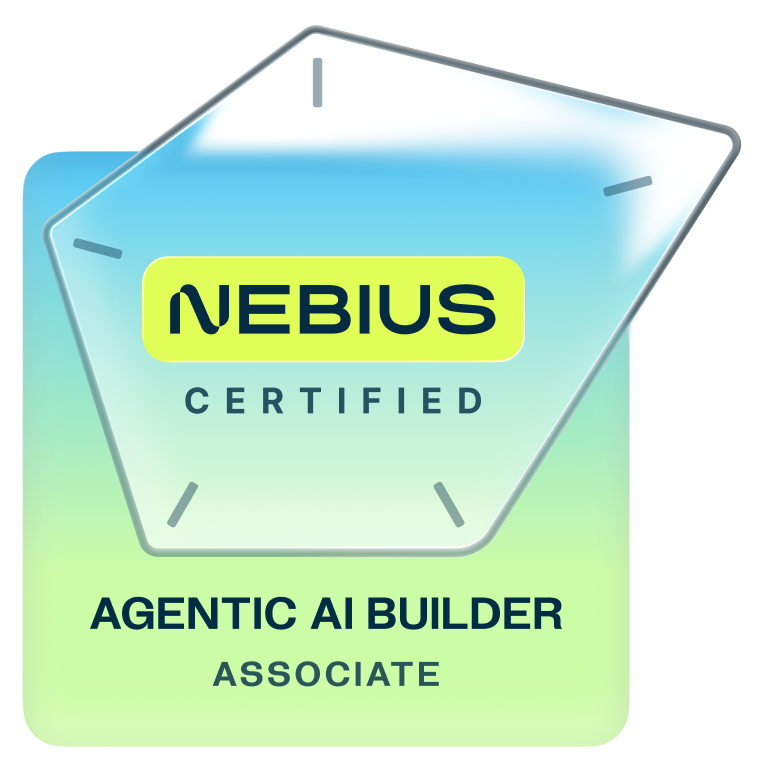
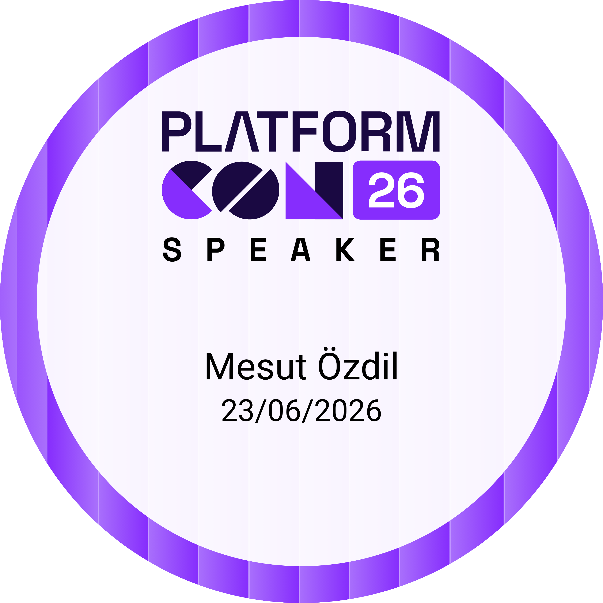

<h1 align="center">Mesut Oezdil</h1>
<p align="center">
  DevOps Engineer &nbsp;·&nbsp; CNCF TAG Infrastructure Tech Lead
</p>

<div align="center">
  
  
  
  
  
  
  
  
</div>

---

## About

```sh
$ whoami
  DevOps Engineer · CNCF TAG Infrastructure Tech Lead

$ cat philosophy.txt
  Be like water. Adapt to the system. Find the path.

$ cat current_work.txt
  GPU virtualization on Kubernetes      Project HAMi
  AI agents as K8s resources            kagent
  CUDA and GPU architecture             Systematic CUDA Learning
  IaC and zero-trust IAM                OpenTofu · Keycloak · Vault

$ cat certifications.txt
  CKS    Certified Kubernetes Security Specialist
  CKA    Certified Kubernetes Administrator
  CDP    Certified DevSecOps Professional
  Nebius AI CloudOps Engineer · Associate
  Nebius Agentic AI Builder · Associate

$ cat writing.txt
  medium.com/@mesutoezdil      real clusters, real output, no fluff
  mesutoezdil.substack.com     no AI-generated noise

$ cat recognition.txt
  CNCF TAG Infrastructure      Tech Lead · Elected Jul 2026
                               github.com/cncf/toc · tags/tag-infrastructure
  Nebius Fellow                Inaugural cohort · 2026
                               nebius.com/fellows
  LiFT Scholarship             Linux Foundation Training · 2026 · linuxfoundation.org
```

<div align="center">

<a href="https://nebius.com/certification"></a>
&nbsp;&nbsp;
<a href="https://nebius.com/certification"></a>

<sub>Nebius AI CloudOps Engineer · Issued Jul 2026 · Expires Jul 2029 · ID: `ce101b80-3542-49b2-a6e1-2f47608da4c1`</sub>
<br/>
<sub>Nebius Agentic AI Builder · Issued Jul 19, 2026 · ID: `6372bd7a-9a02-49d6-ac41-dfc3e7f7ef40`</sub>

</div>

---

## Speaking

**PlatformCon 2026** · June 22–26, 2026 · [Watch on YouTube](https://www.youtube.com/watch?v=IALT3R8mWI8)

> OpenTelemetry After the Hype: Making Observability a Platform Primitive

<a href="https://www.virtualbadge.io/certificate-validator?credential=b9e7bf46-ded8-433b-98c3-e2d8d0b4d504"></a>

---

**OCP AI HW/SW Co-Design Workstream** · Technical Deep-Dives

> **MCP Deep-Dive:** From Protocol Basics to Custom Extensions · May 15, 2026 · [Watch on YouTube](https://youtu.be/cPo8DXYj5pE?si=xNbfNpKuOWw2ox3B)
> A practical tour of the Model Context Protocol, what it is, why it matters, and how to extend it. (JSON-RPC 2.0 · Open Spec · Extensible)

> **A2A Deep-Dive (Part 2 of a Series):** After the Tool Layer: A2A and the Protocols Agents Speak to Each Other · May 29, 2026 · [Watch on YouTube](https://www.youtube.com/watch?v=eXS9BBAKO8A)
> A practical tour of A2A, where it sits next to MCP, and how agents on the wire actually find one another.

---

## Writing

**OTel and Mesh-Derived Metrics: A 2026 Reference** · [CNCF](https://www.cncf.io/)

> A reference on combining OpenTelemetry with service mesh-derived metrics, published on the CNCF blog. June 29, 2026.

[Read on cncf.io →](https://www.cncf.io/blog/2026/06/29/otel-and-mesh-derived-metrics-a-2026-reference/)

---

**OTel and Mesh-Derived Metrics** · [Buoyant](https://www.buoyant.io/)

> OpenTelemetry and Linkerd service mesh metrics, where they complement each other and how to combine them in a unified observability pipeline.

[Read on buoyant.io →](https://www.buoyant.io/blog/otel-and-mesh-derived-metrics)

---

## Publications

**Scheduling Capabilities Suite** · [CNCF](https://www.cncf.io/)

> A scheduler-agnostic evaluation framework for cluster scheduling capabilities, fair-share, backfill, preemption, priority queues, and topology-aware placement, tested against real AI/ML workloads. Starting with Kueue, extended to Volcano and KAI Scheduler as the suite grows.

Continuation of the prior scheduling series · Work in progress

---

**AI Fabric Specialization for Agentic AI** · [Open Compute Project Foundation](https://www.opencompute.org/)

> From General-Purpose Inference to Autonomous, Long-Running Agent Workflows

AI HW/SW Co-Design Workgroup · Co-author · Publishing June 2026

---

**Cloud Native HPC and AI Infrastructure** · [Packt](https://www.packtpub.com/)

> Building High-Performance Computing Platforms with Kubernetes

Co-author with Sanjeev Ganjihal · ~432 pages · Publishing November 2026

---

## Core Tooling

<div align="center">
  
</div>

---

## Tech Stack

**GPU and AI Infrastructure**


**Kubernetes and Cloud Native**


**Infrastructure as Code**


**Identity and Secrets**


**Observability**


**CI/CD and Cloud**


---

## Connect

<div align="center">

[](https://linktr.ee/mesutoezdil)
&nbsp;
[](https://mesutoezdil.medium.com)
&nbsp;
[](https://mesutoezdil.substack.com)
&nbsp;
[](https://github.com/mesutoezdil/Systematic-CUDA-Learning)

</div>
